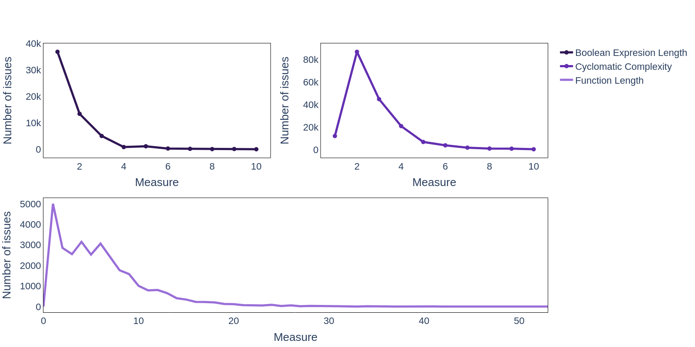
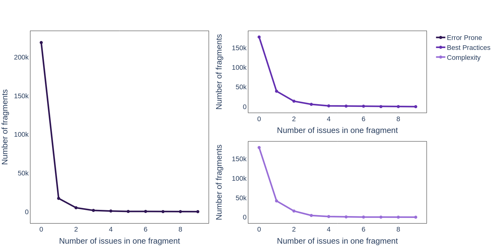

# Raw issue statistics visualization

This script allows you to visualize raw issue statistics for a paper.

## Usage
Run the [raw_issues_statistics_visualization.py](./raw_issues_statistics_visualization.py) with the arguments from command line.

**Required arguments**:

-`stats_path` — path to a file with stats that were founded by [get_raw_issues_statistics.py](../../issues_statistics/get_raw_issues_statistics.py). Must be an xlsx or csv file.
-`config_path` — path to the yaml file containing information about the charts to be plotted. A description of the config and its example is provided in [this section](#config).
-`save_dir` — directory where the plotted charts will be saved. 

**Optional arguments**:
Argument | Description
--- | ---
**&#8209;&#8209;file&#8209;extension** | Allows you to select the extension of output files. Available extensions: `.png`, `.jpg`, `.jpeg`, `.webp`, `.svg`, `.pdf`, `.eps`, `.json`. Default is `.svg`.

## Config
The configuration file is a yaml file where each group name has its config. The group config contains `plot_config` and configs for each column of statistics.

The `plot_config` consists of the following parameters:
- `rows` — number of rows. Default: `1`.
- `cols` — number of cols. Default: `1`.
- `height` — graph height. Default: `800`.
- `width` — graph width. Default: `1600`.
- `x_axis_name` — name of the x-axis. Default: `Value`.
- `y_axis_name` — name of the y-axis. Default: `Quantity`.
- `specs` — сonfiguration of traces on the graph. See [documentation](https://plotly.com/python-api-reference/generated/plotly.subplots.make_subplots.html) for details. Default: `None`.

The column config consists of the following arguments:
- `range_of_values` — allows you to filter the values. It is an array of two values: a and b. Only values that belong to the range [a, b) are taken into account when plotting. By default, all values are taken into account when plotting.
- `trace_name` — trace name. The default is the name of the column.

## Examples
### config.yaml
```yaml
measurable:
  plot_config:
    rows: 2
    cols: 2
    specs: [[{}, {}], [{colspan: 2}, null]]
    x_axis_name: Measure
    y_axis_name: Number of issues
  BOOL_EXPR_LEN:
    range_of_values: [1, 11]
    trace_name: Boolean Expresion Length
  CYCLOMATIC_COMPLEXITY:
    range_of_values: [1, 11]
    trace_name: Cyclomatic Complexity
  FUNC_LEN:
    range_of_values: [0, 60]
    trace_name: Function Length

maintainability_and_cohesion:
  plot_config:
    rows: 2
    width: 1000
    x_axis_name: Lack of measure (%)
    y_axis_name: Number of issues
  MAINTAINABILITY:
    trace_name: Maintainability
  COHESION:
    trace_name: Cohesion

ratio:
  plot_config:
    rows: 2
    width: 1000
    x_axis_name: Ratio (%)
    y_axis_name: Number of fragments
  CODE_STYLE_ratio:
    range_of_values: [ 1, 101 ]
    trace_name: Code Style
  LINE_LEN_ratio:
    range_of_values: [ 1, 101 ]
    trace_name: Line Length

countable:
  plot_config:
    rows: 2
    cols: 2
    specs: [[{"rowspan": 2}, {}], [null, {}]]
    x_axis_name: Number of issues in one fragment
    y_axis_name: Number of fragments
  ERROR_PRONE:
    range_of_values: [ 0, 10 ]
    trace_name: Error Prone
  BEST_PRACTICES:
    range_of_values: [ 0, 10 ]
    trace_name: Best Practices
  COMPLEXITY:
    range_of_values: [ 0, 10 ]
    trace_name: Complexity
```

### measurable.png


### maintainability_and_cohesion.png


### ratio.png


### countable.png

