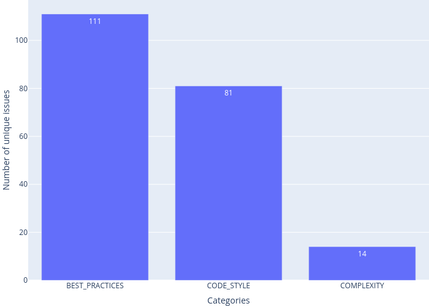
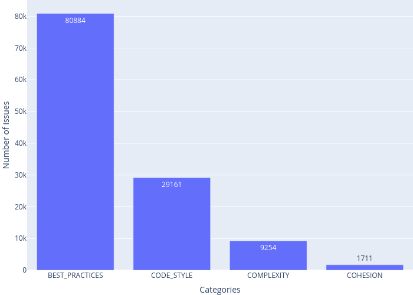
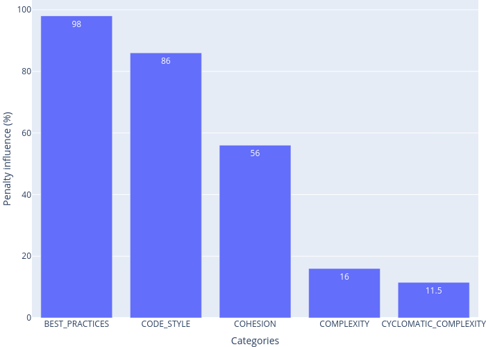
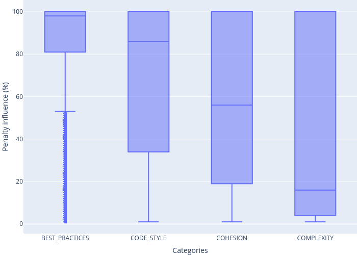

# Hyperstyle evaluation: plots
This module allows you to visualize the data obtained with the [inspectors](inspectors) module

## [diffs_plotter.py](diffs_plotter.py)
This script allows you to visualize a dataset obtained with [diffs_between_df.py](../inspectors/diffs_between_df.py). 

The script can build the following graphs: 
* number of unique issues by category ([Example]())
* number of issues by category ([Example]())
* number of unique penalty issues by category ([Example]())
* number of penalty issues by category ([Example]())
* median influence on penalty by category ([Example]()) 
* distribution of influence on penalty by category ([Example]())

### Usage
Run the [diffs_plotter.py](diffs_plotter.py) with the arguments from command line.

**Required arguments**:
1. `diffs_file_path` — path to a file with serialized diffs that were founded by [diffs_between_df.py](../inspectors/diffs_between_df.py).
2. `save_dir` — directory where the plotted charts will be saved.
3. `config_path` — path to the yaml file containing information about the graphs to be plotted.

**Optional arguments**:

Argument | Description
--- | ---
**&#8209;&#8209;file&#8209;extension** | allows you to select the extension of output files. Available extensions: `.png`, `.jpg`, `.jpeg`, `.webp`, `.svg`, `.pdf`, `.eps`, `.json`. Default is `.svg`.

### Examples

#### Number of unique issues by category

#### Number of issues by category

#### Number of unique penalty issues by category

#### Number of penalty issues by category

#### Median influence on penalty by category

#### Distribution of influence on penalty by category

